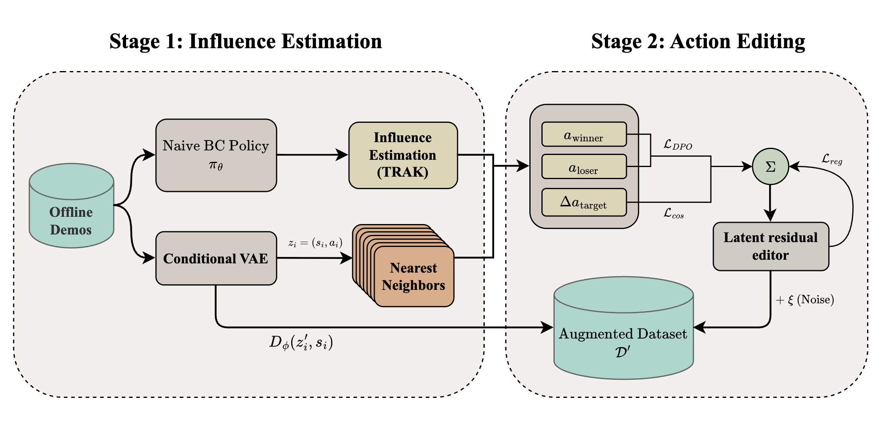
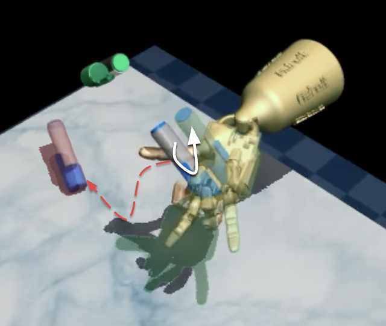
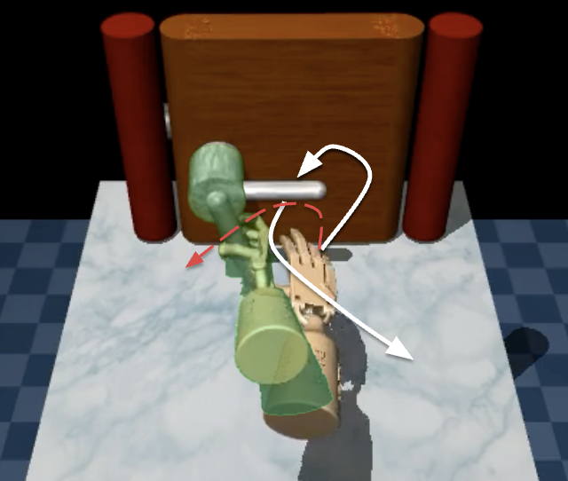
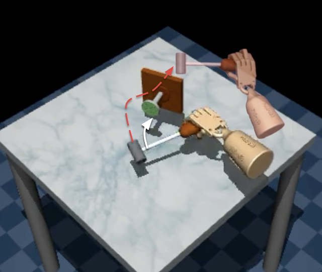
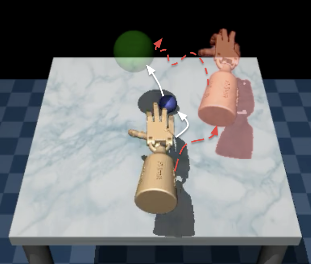

# STRIDE: Strategic Trajectory Refinement via Influence-guided Data Editing

**Stanford CS229 Final Project** | Chiling Han, Timothy Yu, Yash Ranjith

Behavior Cloning assumes optimal demonstrations, yet real-world robotic datasets are frequently noisy and suboptimal. Rather than filtering or discarding bad trajectories (which wastes valuable task-level structure), STRIDE *edits* existing demonstrations in a learned latent space using influence-guided objectives. It estimates per-sample utility via TRAK, encodes actions through a conditional VAE, and trains a DPO-based residual editor using influence-derived preference pairs to predict corrective latent perturbations.

---

## Architecture

<p align="center">
  
</p>

STRIDE is a two-phase framework:
- **Stage 1 -- Influence Estimation:** Train a naive BC policy, compute TRAK influence scores to identify helpful vs. harmful training samples, encode state-action pairs into a latent space via a conditional VAE, and construct preference pairs from nearest neighbors.
- **Stage 2 -- Action Editing:** A DPO-trained latent residual editor predicts corrective perturbations guided by influence-derived preferences. Edited actions are decoded back to action space and used to train the final BC policy.

---

## Results

### Edited Trajectories

Original vs. STRIDE-edited trajectories across all four Adroit Hand tasks:

<p align="center">
  
  
  
  
</p>
<p align="center">
  <b>(a)</b> Pen Rotation &emsp;&emsp;&emsp;&emsp;&emsp;&emsp;
  <b>(b)</b> Door Open &emsp;&emsp;&emsp;&emsp;&emsp;&emsp;
  <b>(c)</b> Hammer Nail &emsp;&emsp;&emsp;&emsp;&emsp;&emsp;
  <b>(d)</b> Relocate Ball
</p>

STRIDE edits localized suboptimal segments while preserving surrounding trajectory structure. On Door, the editor discovers an elevated approach arc not seen in the original demos. On Hammer, noisy approach paths are replaced with straighter strike trajectories. On Relocate, high-frequency jitter in the grasp-and-transport phase is suppressed.

### Quantitative Results

Task success rate (%) on Adroit Hand benchmarks, averaged over 10 seeds (50 rollouts each):

| Method | Hand-Pen | Hand-Door | Hand-Hammer | Hand-Relocate |
|:-------|:--------:|:---------:|:-----------:|:-------------:|
| Vanilla BC | 71.5 | 8.0 | 0.5 | 0.5 |
| Best Gaussian Filtering | 64.0 | 22.4 | 0.8 | 8.4 |
| Best CUPID | 66.7 | 11.5 | 4.8 | 2.4 |
| Best CUPID-Quality | 68.0 | 10.0 | 4.8 | 2.4 |
| **STRIDE (Ours)** | **83.0** | **49.8** | **20.2** | **13.8** |

STRIDE outperforms all baselines on every task -- **+11.5%** over Vanilla BC on Pen, **+41.8%** on Door, **+15.4%** on Hammer, and **+5.4%** on Relocate. Filtering and curation methods like CUPID struggle with data scarcity (~25 demos per task), since discarding even a fraction of trajectories leaves the policy with insufficient state-space coverage. STRIDE sidesteps this by editing rather than discarding.

---

## Setup

### Environment

```bash
conda create -n stride_new python=3.10 -y
conda activate stride_new

# Install MuJoCo (if not already installed)
pip install mujoco

# Install all Python dependencies
pip install -r requirements.txt
```

**Dependencies** (see `requirements.txt`):
- `torch>=2.0` -- deep learning (requires `torch.func` for TRAK)
- `gymnasium>=0.29` + `gymnasium-robotics>=1.2` -- Adroit environments
- `minari>=0.4` -- D4RL dataset loading
- `mujoco>=3.0` -- physics simulation
- `wandb` -- experiment logging
- `imageio` + `imageio-ffmpeg` -- video saving
- `scipy`, `scikit-learn`, `matplotlib`, `numpy`, `h5py`

Verify the environment:
```bash
python -c "import torch; print(torch.__version__, torch.cuda.is_available())"
python -c "import gymnasium; import gymnasium_robotics; gymnasium.make('AdroitHandPen-v1')"
python -c "import minari; minari.load_dataset('D4RL/pen/human-v2', download=True)"
```

### Running Experiments

**Smoke Test** (run first to verify everything works):

```bash
python -m experiments.run_experiments \
    --task pen \
    --method all \
    --device cuda \
    --seed 42 \
    --n-trials 1 \
    --n-eval-episodes 2 \
    --trak-n-rollouts 5 \
    --no-wandb \
    --no-video
```

**Full Run** (all 4 tasks x 14 methods x 10 trials):

```bash
python -m experiments.run_experiments \
    --task all \
    --method all \
    --device cuda \
    --seed 42 \
    --n-trials 10 \
    --n-eval-episodes 20 \
    --trak-n-rollouts 100
```

**Run specific methods:**

```bash
# Baselines only
python -m experiments.run_experiments --task pen \
    --method vanilla_bc,gaussian_25,gaussian_50,gaussian_75 --n-trials 10

# CUPID variants only
python -m experiments.run_experiments --task pen \
    --method cupid_25,cupid_50,cupid_75,cupid_quality_25,cupid_quality_50,cupid_quality_75 --n-trials 10

# STRIDE and ablations only
python -m experiments.run_experiments --task pen \
    --method stride,stride_no_influence,stride_random_edits,influence_reweight --n-trials 10
```

**Options:**
- `--no-wandb` -- disable wandb logging
- `--no-video` -- disable video rendering (faster evaluation)

### Repository Structure

```
stride/
  data.py                # Minari data loading for Adroit human-v2 tasks
  influence.py           # KNN-based corrective directions and preference pairs
  editing.py             # STRIDE two-stage editing pipeline
  scoring.py             # TRAK influence scoring
  models/
    policy.py            # MLP Behavioral Cloning policy
    vae.py               # Conditional VAE for action representations
    editor.py            # Latent-space residual editor
  training/
    train_bc.py          # BC training with wandb logging
    train_vae.py         # VAE training with beta-annealing
    train_editor_dpo.py  # DPO editor training
  eval/
    evaluate.py          # Evaluation with video rendering
  baselines/
    gaussian_filter.py   # Gaussian temporal smoothing
    cupid_filter.py      # CUPID demo curation
    cupid_quality.py     # CUPID-Quality demo curation
    random_latent.py     # Random latent edits (ablation)
experiments/
  configs.py             # All experiment configurations
  run_experiments.py     # Main experiment runner
  plot_results.py        # Result visualization
results/                 # Output directory (auto-created)
```
