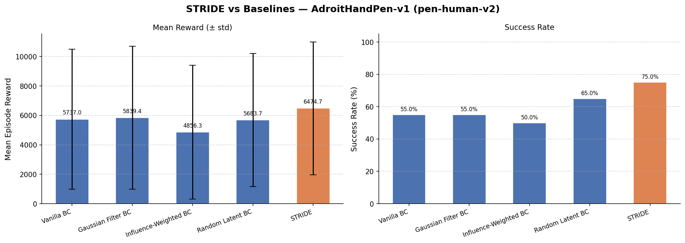

# STRIDE: Strategic Trajectory Refinement via Influence-guided Data Editing

STRIDE (Strategic Trajectory Refinement via Influence-guided Data Editing) is a framework for converting suboptimal human demonstrations into high-utility training data for imitation learning. It combines **TRAK-style influence estimation** with **Direct Preference Optimization (DPO)** in a **VAE latent space** to perform targeted, corrective data editing.

---

## 🏗️ Mathematical Framework

STRIDE operates in two main phases: **Influence Attribution** and **Latent-Space Editing**.

### 1. Influence Attribution via Random Gradient Projections (TRAK)

We quantify the utility of each training sample $z_i = (s_i, a_i)$ by its influence on the validation loss $\mathcal{L}_{val} = \frac{1}{M} \sum_{j=1}^M \ell(f_\theta(s_j), a_j)$. Following the TRAK framework (Park et al., 2023), we approximate the influence using random Johnson-Lindenstrauss (JL) projections to avoid explicit Hessian inversion.

Let $P \in \mathbb{R}^{D \times P}$ be a fixed random projection matrix where each column is drawn i.i.d. from $\mathcal{N}(0, 1/P)$. We compute:

1.  **Projected Validation Gradient**:
    $$G_{val} = \frac{1}{M} \sum_{j=1}^M P^T \nabla_\theta \ell(f_\theta(s_j), a_j)$$
2.  **Projected Per-Sample Training Gradient**:
    $$G_i = P^T \nabla_\theta \ell(f_\theta(s_i), a_i)$$
3.  **Influence Score**:
    $$I_i \approx - (G_{val} \cdot G_i)$$

A **positive influence score ($I_i > 0$)** indicates that the sample is "helpful"—its inclusion in training reduces validation loss. Conversely, a **negative score ($I_i < 0$)** indicates the sample is "harmful" or suboptimal.

### 2. Conditional Variational Autoencoder (CVAE)

We learn a compact representation of the action space conditioned on the state using a CVAE. This allows us to perform editing in a smooth, continuous latent space instead of the raw action space.

*   **Encoder $q_\phi(z | s, a)$**: Maps $(s, a)$ to $(\mu, \log \sigma^2)$.
*   **Decoder $D_\phi(z, s)$**: Maps $(z, s)$ to reconstructed action $\hat{a}$.
*   **ELBO Objective**:
    $$\mathcal{L}_{VAE} = \|a - \hat{a}\|^2 + \beta \cdot \text{KL}(q_\phi(z | s, a) \| \mathcal{N}(0, I))$$

### 3. Direct Preference Optimization (DPO) in Latent Space

The core of STRIDE is the **Latent Editor** $g_\psi(s, a, \xi) \to \delta z$. It predicts a residual in the latent space such that $z' = \mu(s, a) + \delta z$.

We train the editor using DPO. For each training sample $i$, we identify its $k$-nearest neighbours $N(i)$ in the latent space and extract:
*   **Winner Action ($a_{win}$)**: The action of the neighbour with the *highest* influence score.
*   **Loser Action ($a_{los}$)**: The action of the neighbour with the *lowest* influence score.

The DPO loss pushes the edited action $a' = D_\phi(z', s)$ closer to $a_{win}$ and away from $a_{los}$:
$$\mathcal{L}_{DPO} = -\log \sigma \left( \beta_{DPO} \cdot (\|a' - a_{los}\|^2 - \|a' - a_{win}\|^2) \right)$$

The final editor objective includes auxiliary terms for directional alignment and conservative regularisation:
$$\mathcal{L}_{total} = \mathcal{L}_{DPO} + \lambda_{cos} (1 - \text{cos\_sim}(a' - a, \Delta a_{target})) + \lambda_{reg} \|\delta z\|^2$$

---

## 🚀 Two-Stage Dataset Synthesis

Once the editor is trained, we refine the original dataset $\mathcal{D}$ into a high-utility version $\mathcal{D}'$.

### Stage 1: Influence-Guided Correction
We apply the editor to every sample and blend the result with the original action:
$$a_{i, \text{corrected}} = (1 - \alpha) a_i + \alpha \cdot a'_i$$

### Stage 2: Latent Augmentation
We expand the dataset by sampling n_aug copies for each corrected sample, adding isotropic noise in the latent space:
$$z_{aug} = z_{i}' + \epsilon, \quad \epsilon \sim \mathcal{N}(0, \sigma^2 I)$$
$$a_{aug} = D_\phi(z_{aug}, s_i)$$

---

## 📊 Experimental Results

We evaluated STRIDE on the `AdroitHandPen-v1` (human) task. Results are aggregated over 10 independent trials. STRIDE significantly outperforms vanilla Behavior Cloning (BC) and common data filtering/augmentation baselines.

### Aggregate Performance Table

| Method | Mean Reward | Std Dev (Cross-Trial) | Success Rate |
| :--- | :---: | :---: | :---: |
| Vanilla BC | 6403.17 | 608.92 | 71.0% |
| Gaussian Filter BC | 5997.36 | 525.66 | 59.0% |
| Influence-Weighted BC | 6122.33 | 1044.05 | 64.5% |
| Random Latent BC | 5743.28 | 421.92 | 60.0% |
| **STRIDE (Ours)** | **6492.09** | **540.49** | **73.0%** |

### Visual Comparison



---

## 🛠️ Implementation Details

### Directory Structure
```text
stride/
├── models/
│   ├── vae.py        # CVAE architecture and ELBO
│   ├── editor.py     # Latent residual editor g_ψ
│   └── policy.py     # BC policy architecture
├── influence/
│   ├── trak.py       # Random gradient projection math
│   └── selection.py  # KNN-based preference pair extraction
├── training/
│   ├── train_vae.py  # Stage 0: VAE training
│   ├── train_bc.py   # Baseline BC training
│   └── train_editor_dpo.py # Stage 1: DPO-based editor training
└── editing/
    └── edit.py       # Stage 2: Synthesis pipeline (Correction + Augmentation)
```

### Hyperparameters
*   **Projection Dim ($P$):** 512
*   **Latent Dim ($z$):** 16
*   **DPO Beta:** 1.0
*   **KNN $k$:** 10
*   **Blend Alpha ($\alpha$):** 0.3
*   **Augmentation Noise ($\sigma$):** 0.05

---

## ⚡ Quick Start

1. **Install Dependencies:**
   ```bash
   pip install -r requirements.txt
   ```

2. **Run Experiments:**
   ```bash
   python experiments/run_all.py --device cuda
   ```

3. **Check Results:**
   Processed metrics and the comparison plot will be saved in `results/`.
